Our cruise is called “Dutch Isles Delights” and is a 12 day voyage on the Oceania Allura. This is the second time we have cruised on the Allura, previously in November of 2025, and our fifth time on Oceania Cruise Line. This cruise has almost the same itinerary as the cruise we took in November. One reason we took an almost identical cruise was that our Future Cruise Certificate's extra benefits were about to expire. The other reason was that I wanted to visit the island of St. Vincent.

About 75 days prior to embarkation we were able to book dining reservations for specialty restaurants. It was important to book dining reservations as soon as possible to secure non-sharing tables at reasonable times. Also, as soon as we were given status matching we started to book shore excursions. On this cruise we have a bit over $2,000 in non-refundable onboard credit, about half of which came from status matching to the President's Circle level. The other half came from various booking promotions. 

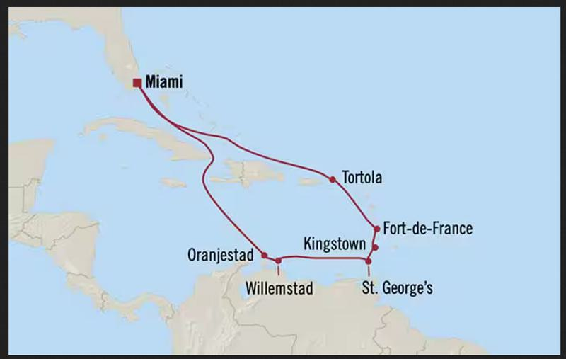

## Mar-7-Sat, Travel Day
Because our flight was scheduled to depart LAX at 6:00am, we started our journey exceptionally early. We left home at 1:30am for the 50-mile drive to Van Nuys, where we utilized the FlyAway terminal. It’s a fantastic, affordable alternative for travelers; the facility offers ample long-term parking and a reliable non-stop bus service directly to the airport.

Traffic on the freeway was light, allowing us to make good time. After dropping Becky off at the terminal to secure our spot in line, I headed to the parking garage. It was less than half full, so I easily snagged a spot on the first level. By the time I returned to the terminal, there were only about ten people ahead of us.

The process was efficient: after a ten-minute wait, a porter loaded our bags, and the bus departed right on time at 3:00am. We reached LAX Terminal 1 by 3:24am, and after a quick ten-minute loop through the other stops, we arrived at Terminal 4, the American Airlines hub.

Inside, we were met with a massive crowd at baggage check. While the First Class line was shorter, there was only one agent on duty, so it still took about 20 minutes to check our two bags.

The recently remodeled American Airlines terminal is impressive, though it requires quite a bit of trekking. We navigated two flights of escalators to reach security, where, thankfully, the TSA PreCheck lines were short. From there, it was another three escalators and a 15 minute walk to our gate. We were settled in by 4:20am, leaving us an hour to relax before boarding.

Shortly after we sat down, we received a notification that the flight was delayed by 30 minutes. The plane was completely overbooked, with 30 people lingering on the standby list. We finally boarded and were in our seats by 6:00am; at 6:30am, we pushed back from the gate. Aside from some light turbulence during takeoff, the flight was smooth.

To pass the time, I watched Jurassic World Rebirth. As the seventh installment in the franchise, it was a decent "airplane movie" - entertaining enough, but not something that required my full attention. For breakfast, I had biscuits and gravy with scrambled eggs. While the biscuits were a bit soggy, the yogurt and fresh fruit were excellent, especially paired with a coffee and Baileys.

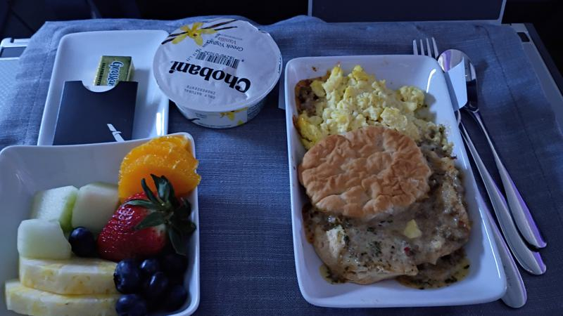

After the movie, I started the audiobook _Cabin_ by Patrick Hutchinson. It’s a fascinating account of building an off-grid home in Washington’s Cascade Mountains. I recognized the author from a feature in the University of Washington Alumni magazine, though I only made it to Chapter 4 before falling asleep.

We touched down in Miami around 2:00pm local time to 80°F weather and a pleasant breeze. The hotel shuttle arrived about 40 minutes after we claimed our luggage, and by 3:30pm, we were officially checked into our room.

Later that afternoon, we took a ten-minute walk to a local grocery store to stock up on snacks. On the way back, we grabbed a quick dinner at Burger King, a Whopper for me and a chicken sandwich for Becky.

Before turning in for the night, we made sure to set our clocks ahead one hour for the start of Daylight Savings Time. This change should simplify things for our cruise, as it likely means all our ports of call will be synchronized with our local time in Miami.

## Mar-8-Sun, Layover Day
I woke up around 6:00am today and, after a quick shower, headed downstairs for coffee and yogurt to start the morning. Once Becky was ready, we went back down around 8:30 for a second breakfast of scrambled eggs, potatoes, and ham. The lobby was buzzing with energy; it was easy to spot the fellow travelers heading out for their cruises by the colorful luggage tags dangling from their bags.

The weather here in Miami is beautiful - sunny throughout the day with a high of 79°F and just a light breeze from the east. We spent some time relaxing over a few rounds of Kings on the Corner and Gin Rummy.

Around 11:00am, we took a short five-minute walk to Starbucks and used our rewards stars to grab a couple of free large coffees. Later that afternoon, we headed out for a longer stroll down to the Hilton Blue Lagoon. We managed to snap some great photos of the local iguanas and spent a while watching planes depart from the airport. We even spotted "Trump’s" Air Force One parked out on the tarmac at Miami International.

For dinner, we kept things simple with takeout from a nearby Chipotle. I ordered a burrito while Becky opted for a burrito bowl. It’s probably been over a decade since I last ate at a Chipotle, and the food was surprisingly good and very filling.

::: {layout-ncol=2}

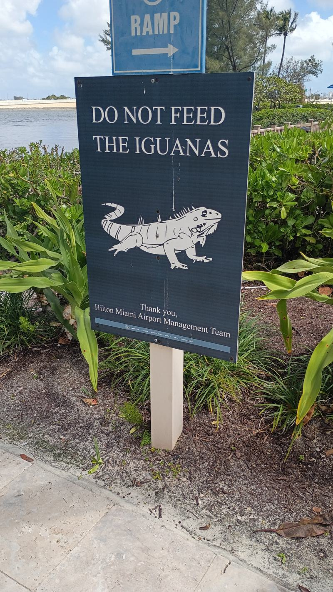

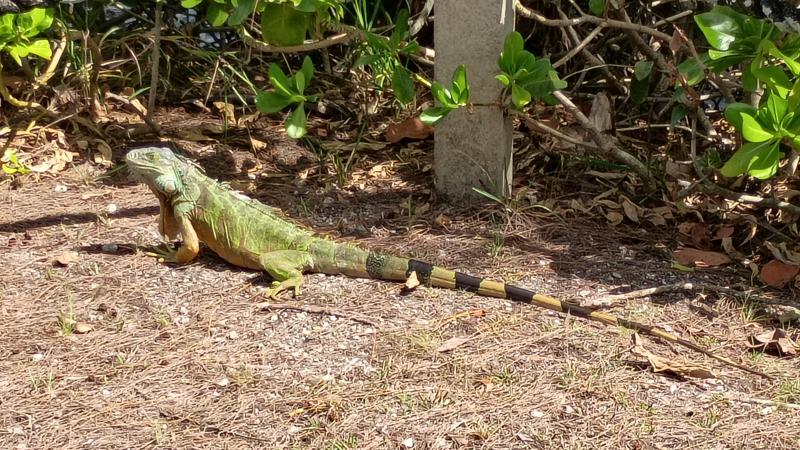

:::

## Mar-9-Mon, Embark, Miami, Florida
The day started early with a 6am shower and a trip to the lobby for coffee, though I was disappointed to find they were out of yogurt. Back in the room, we organized our luggage and checked Google Maps. Noticing heavy traffic toward the port, we decided to head out earlier than planned.

We checked out at 8:45am and hailed a Lyft. Despite the traffic, the ride took only 30 minutes, and we arrived at the terminal by 10:30am. The timing was perfect; just as we reached the waiting area, our group was called for check-in. The entire boarding process felt much more organized than our trip in November, as they called specific categories rather than allowing a general rush to the front. After a brief five-minute wait, we were officially on board.

![This a view of the waiting area inside the port of Miami terminal J. When we arrived there were about 100 people waiting and they were just calling for passengers booked into the top suites to begin check in. Since we are President's Circle level, we also got to get in line for registration. In the photo you can see the lanes for the different cabin categories. The black carpet is for President's Circle, Diamond and Platinum level guests. Next is the gold carpet for Owner, Vista and Oceania suite guests. The next lane is for the penthouse category guests.](IMG_20260309_104748213_HDR.jpg)

Once on the ship, our first stop was the Restaurant Reservation desk. Since our first choice was fully booked, we secured a non-sharing table at the Polo Steakhouse for tonight. Becky also signed up for the Gerard Bertrand Wine Pairing Lunch, scheduled for our second day at sea.

For lunch, we headed to Waves, the poolside grill. I had a panini, while Becky ordered a lobster roll and a shrimp salad sandwich (both bunless). Unfortunately, her lobster was undercooked, so she didn't eat much of it. To pass the time until our cabins were ready, we retreated to Baristas. I enjoyed a cappuccino and a small Quiche Lorraine before we finally headed to our room, where our checked bags were already waiting.

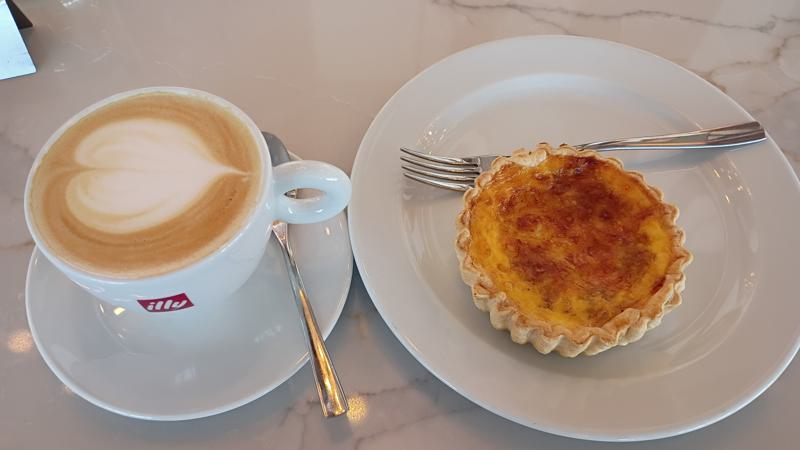

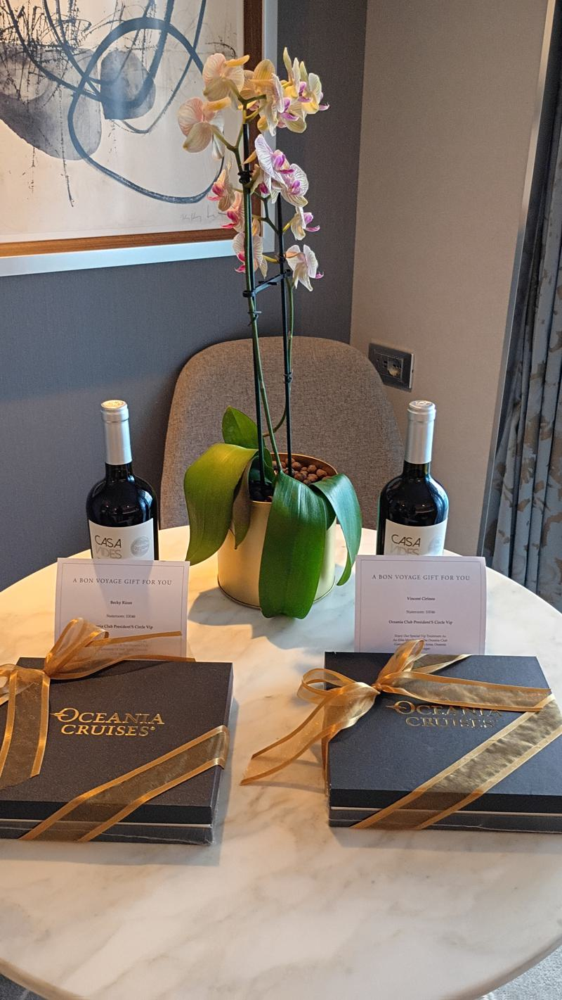

After a bit of unpacking, we set out to explore. We realized we hadn't checked into our muster station yet, so we handled that first. From there, we stopped by the spa to book haircut appointments and visited the library to pick up sheets for the art scavenger hunt.

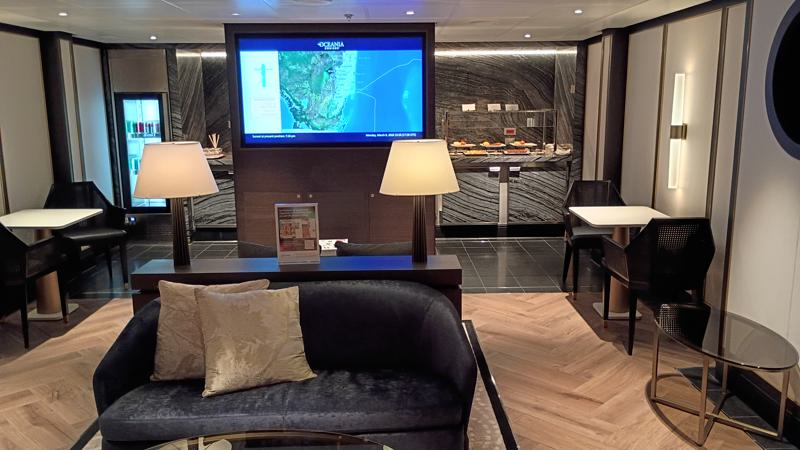

By 3pm, we finished unpacking and spent some time working on the scavenger hunt. At 5pm, we returned to our room to watch the ship pull out of port.

Before dinner, we grabbed cocktails at the Founders Bar. Becky tried the "Not So Sure," a smoky Old Fashioned riff, while I had "The Parisian." The latter was a mango vodka drink that felt a bit too tropical and sweet for a pre-dinner cocktail; it had more of a poolside vibe.

We had dinner at Polo Grill, the steakhouse, where Becky had the rack of lamb and I had the filet mignon. While the food was good, the service was a bit slow. We didn't mind, though, as the evening show wasn't until 9:30pm.

We attended "Flashback," a high-energy tribute to the music of the 60s, 70s, and 80s performed by the Allura Production Company. We intentionally sat at the end of a back row for an easy exit. I'll admit I drifted off for parts of it; Becky insisted I missed the best segments!

The highlight of the show was actually the comedy unfolding in the audience. Halfway through, a couple asked the people next to us to slide down to make room. Ten minutes later, the couple who had moved over suddenly got up and left. The man who asked them to move joked, "Is it my B.O.?" Moments later, the entire row in front of us stood up and walked out too. It was quite funny watching nearly ten people in our immediate vicinity vanish all at once. I think the other people had the same problem I had, which was they couldn't stay awake.

## Mar-10-Tue, At Sea
After a restless night, I was up at 6am. I showered and headed to the Horizon Lounge for a quiet start to the day. The lounge was completely empty, allowing me to enjoy a cappuccino from the automatic machine while I worked on my journal in peace. About twenty minutes later, the first of the other passengers began to trickle in.

Once Becky was ready, we headed over to Baristas. I opted for a small pastry and an Americano with cream; I’ve decided to make that my new "go-to" order, as I’m starting to tire of all the milk in the cappuccinos. For breakfast, we visited the Grand Dining Room. I had a Spanish omelet with a side of corned beef hash, while Becky chose a Western omelet with two small lamb chops.

We spent the rest of the morning staying active. We played a round of miniature golf to earn some O-points, then decided to browse the gift shops now that they were open. My shopping luck was a bit thin; I tried on some sweatpants that didn't fit quite right, and though we looked at the men’s t-shirts, they only had smalls in stock. It looks like I won’t be adding any ship apparel to my wardrobe this trip!

At 11am, Becky and I headed to the spa for our haircuts. I had intentionally let mine grow out a bit in anticipation of getting it cut on board. While I was happy with how mine turned out, I don’t think Becky was quite as pleased with hers.

Lunch was at the Terrace Café, which featured a Mexican theme today. Of course, we followed that up with a trip to the creperie for some ice cream.

We spent the afternoon keeping busy:

- O-Point Challenges: We participated in several events to accumulate more points.
- Art Scavenger Hunt: In the gaps between events, we continued hunting for answers around the ship.
- Afternoon Tea: We made sure to attend tea time. Oceania truly puts on one of the best spreads we’ve ever experienced.

We decided to try our hand at afternoon trivia. We originally planned to play as a duo, but a few other passengers asked to join us. I’m not sure if we looked particularly brainy or if they just felt sorry for us, but we eventually formed a team of six. We made sure to manage expectations by letting them know we wouldn't be playing every single day! We ended up with a score of 9 out of 15. While not enough to place (third place was 12), I was happy to be above the 50% mark.

Before dinner, we attended the Captain’s Cocktail Party. Thanks to a lesson learned on our last cruise, we knew to arrive early to snag a seat before the crowds arrived. They served complimentary cocktails throughout the ship from 5:30 to 7:00pm.

For dinner, we returned to the Grand Dining Room. Becky enjoyed the lobster special while I had the pork belly. We decided to skip the formal dessert course, opting instead to head up to the buffet, where Becky, still hungry for seafood, ordered another grilled lobster!

Before the main show, we dropped by Martini’s Bar for evening trivia. We were invited to join another team, and this time, our luck changed: we took first place! We walked away with three O-points each. (It was this trivia team that we would join for the remainder of the cruise.)

We capped off the night with a comedy set by Cory Kahaney. Her "stand-up with a New York accent" was genuinely funny, and I found myself laughing throughout the set. In our usual fashion, we sat in the back just in case we wanted to make an early exit, but we stayed for the whole thing. The man sitting behind me certainly enjoyed it; he laughed at every single joke and then repeated them loudly to his wife, who I suspect didn't have her hearing aids in!

## Mar-11-Wed, At Sea
I was up at 6am, showered and settled into the Horizon Observation Lounge. There is something uniquely peaceful about working on trip reports with a coffee in hand while watching the sun rise over the water.

Once Becky was ready, we made a quick stop at Baristas. I opted for an Americano with cream, while Becky went with an Aspen coffee. We couldn’t resist a few treats from the bakery - the Lime Chouquettes and Pain aux Raisins were the perfect morning accompaniment.

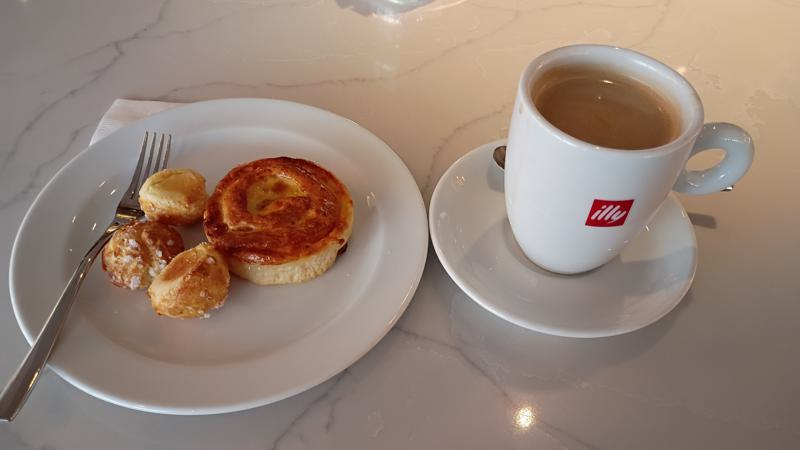

For a more formal start, we headed to the Grand Dining Room, where I enjoyed Eggs Benedict and Becky had the pecan pancakes.

Energized by breakfast, we spent the morning chasing O-Points through various activities. Along the way, we ran into Damien, the Hotel Director. He insisted we would definitely find time for dinner together during this cruise, but I’m not holding my breath just yet!

![Here the passengers are playing a game of Jenga. The name comes from the Swahili word kujenga, which means 'to build or construct'. Players take turns removing one block at a time from a tower constructed of 54 blocks. Each block removed is then placed on top of the tower, creating a progressively more unstable structure. The game ends when the tower falls over. The passengers were divided into two teams and one member from each team would take a turn removing a block of wood. Becky's name was at the bottom of her team's list and she was hoping that the tower would fall before her name was called. Lucky for her, the tower fell before he name was called. She received one O-point since her team had caused the tower to fall.](IMG_20260311_104511933_HDR.jpg)

At noon, we attended a standout culinary event, the Gérard Bertrand Wine Pairing Lunch. This six-course experience, designed in collaboration with the famed French winemaker, Gérard Bertrand, and featured impressive food presentations and excellent pairings. We shared a table with Laurie and Bill, a friendly couple from Connecticut. The conversation flowed as easily as the wine, making for a very pleasant afternoon.

::: {layout-ncol=2}

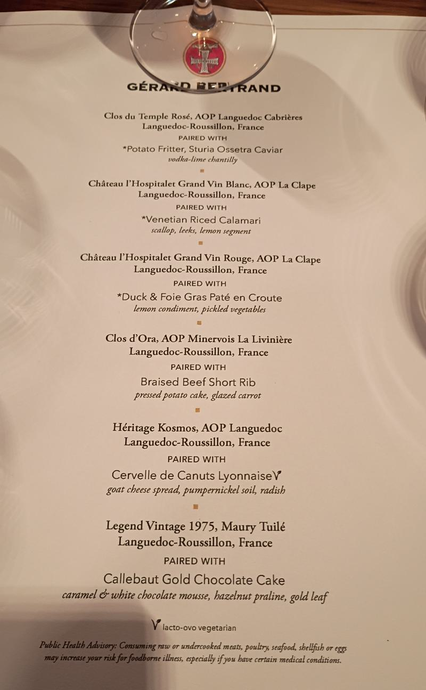

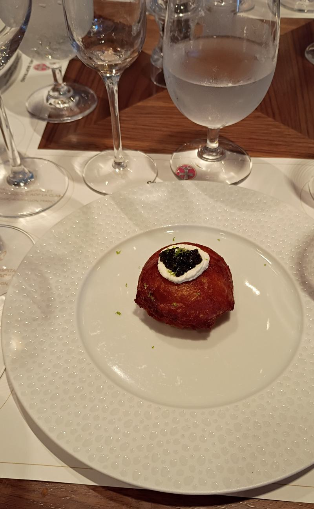

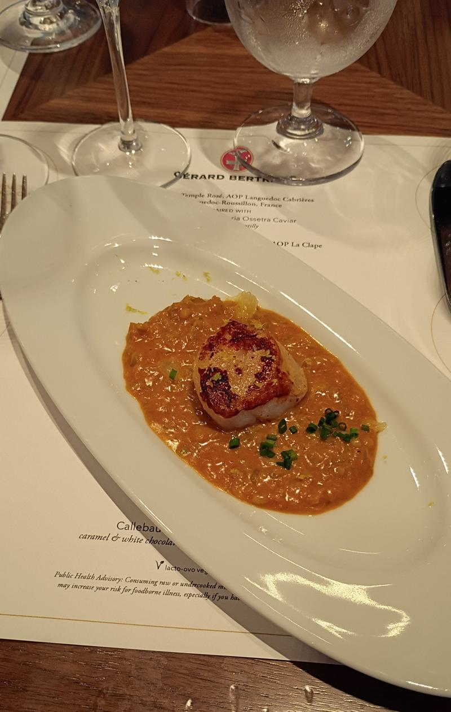

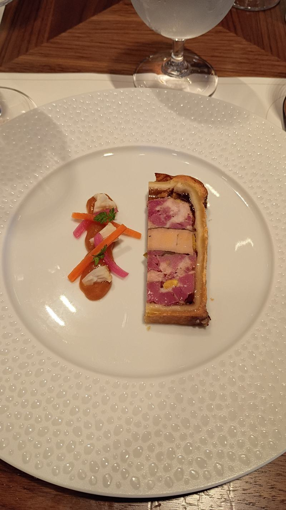

:::

While the Gérard Bertrand Wine Pairing Lunch was a lot of fun and it was interesting to taste the wine and French food, we would probably not repeat this event again, but instead on a future cruise try the other wine pairing lunch, called the Sommelier’s Choice Wine Pairing Lunch. 

The social streak continued at Afternoon Tea, set to the soothing sounds of a string quartet. We stayed until the very end, chatting with Alan and Shirley from California, an inspiring couple (82 and 80 respectively) celebrating Alan's recent retirement as an oral surgeon. We were also joined by Barry, a retired ophthalmologist from Canada.

On the way back to our suite, our butler informed us that we had 6:30pm reservations at Polo Grill, at a non-sharing table. After a quick pre-dinner drink at the Martini Bar, we headed to Polo Grill for dinner. My blackened salmon was excellent, but Becky’s roasted prawns were the real showstoppers, they were easily the size of lobster tails.

To wrap up the night, we rejoined our team from the previous evening for Trivia. Our synergy paid off; we took first place and secured three more O-Points each!

The night concluded at the Blue Party. Following the theme, everyone was decked out in blue while the band played 70's and 80's hits. It was a packed house-we could only find seats in the back, and while the two signature cocktails didn't quite hit the mark for us, the atmosphere was a great way to end the day.

## Mar-12-Thu, Oranjestad, Aruba
The day started early at 5am. I grabbed my first coffee at the Horizon Lounge, followed by a second round at Baristas once Becky was ready. I opted for an Americano with cream, while Becky treated herself to a latte with Bailey’s.

We headed to the Grand Dining Room for breakfast, where I had poached eggs on avocado toast and Becky went with a Western omelet.

We still have one art piece left to find for our scavenger hunt. After some initial searching, we got a tip from a reliable source that it’s hidden somewhere in the Red Ginger Restaurant. Later, we split up for a bit: I headed upstairs for the craft session to make a bookmark, while Becky joined some activities to rack up more O-points.

The ship docked in Aruba at 11am. Becky and I took a stroll into town, though we only made it as far as the bridge before heading back to the ship an hour later. We spent about an hour by the pool, though the weather was quite windy and overcast.

::: {layout-ncol=2}

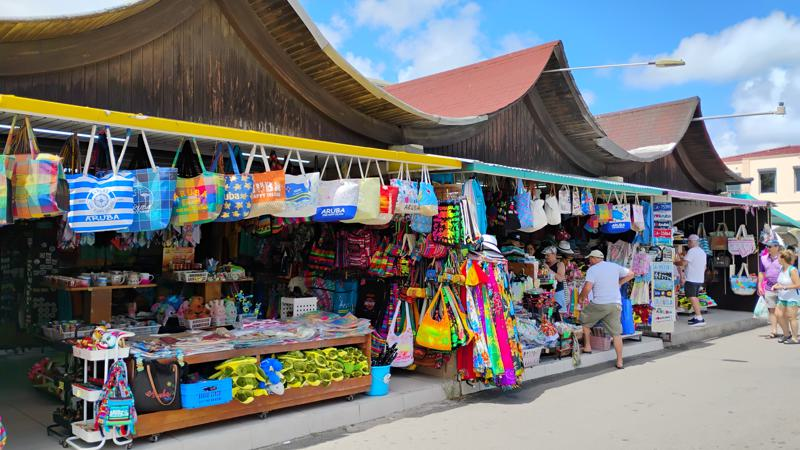

:::

Once back in our room, we enjoyed a quiet moment on the balcony with small sandwiches and a glass of red wine. While Becky was getting ready for dinner, I played Top Toss and secured three O-points. Later I had an iced coffee and a brioche cube sandwich while viewing the pool and deck lounge chairs which were starting to fill as passengers returned from their time in port.

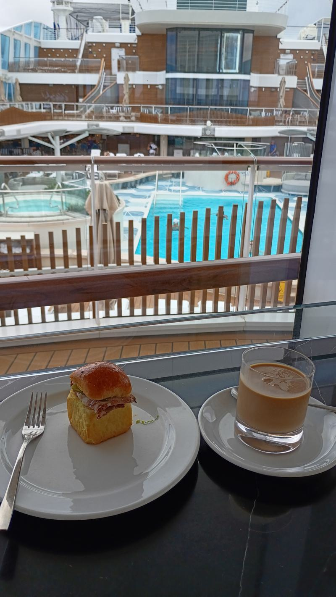

At 5pm, we got the call we were waiting for, our standby reservation at Red Ginger for a non-sharing table was confirmed!

Before dinner, we stopped by the Founders Bar for drinks, where we had to endure a rather tedious conversation with a couple from Florida. Fortunately, dinner made up for it, I had the Thai curry chicken and Becky enjoyed the lamb chops. We capped off the night with trivia. We managed to snag third place, earning us one more O-point each.

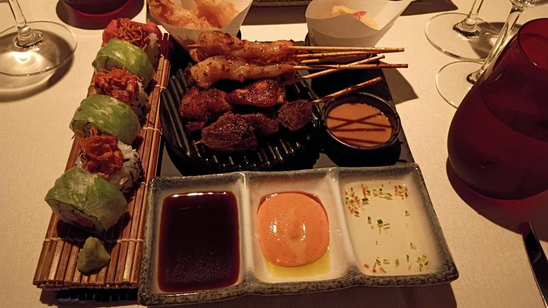

## Mar-13-Fri, Willemstad, Curaçao
Our port today is Willemstad, the vibrant capital of Curaçao, where the ship will overnight at dock. We signed up for an excursion called, "Discover Curaçao’s Beautiful Beaches", which promised an hour of relaxation at each stop.

The day started early with a 5:30am wake-up call and a hearty breakfast of omelets, bacon, and sausage delivered to our suite. By 8:45am, we were at the ship’s theater for our tour meet-up. After a brief wait, we headed to the buses, where our guide enforced a rather unusual rule -  everyone had to apply their sunscreen before boarding. Luckily, Becky and I were already prepared, having lathered up back in the cabin.

The ride wasn't without its fair share of drama. Two passengers behind us decided to help themselves to the reserved seats at the front. When the guide questioned them, they claimed their original seats were "too lumpy" and eventually they were allowed to stay in the reserved seats, much to the collective eye-rolling of everyone else on the bus.

Our first stop was to Daaibooi Beach, a slice of paradise. Known for its dramatic color shift from pale turquoise to electric blue, the view from the cliffside lookout was nothing short of cinematic. With its white sands framed by limestone cliffs and a "wild" feel, it’s easily the most iconic beach on the island.

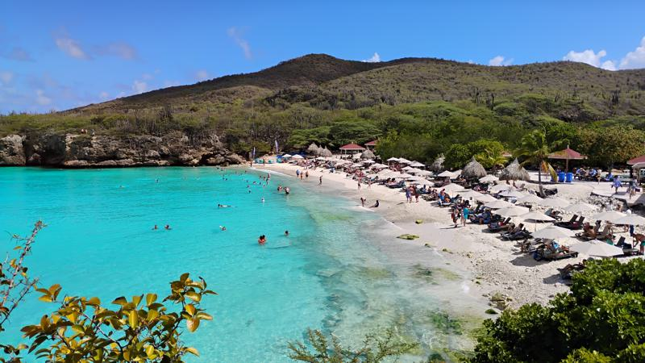

Our second stop brought us to Cas Abao, a pristine, privately managed beach. We were given tickets for drinks, showers, and chairs, though interestingly, no one ever came around to collect them.

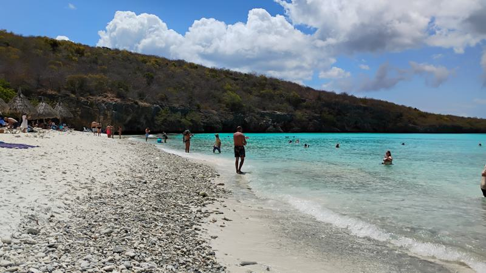

The guide had another moment here; while she was giving instructions, several people (Becky included!) wandered off to claim chairs. The guide made a snarky comment about people not wanting to hear "important things", though as it turned out, she didn't have much else of substance to say!

Our guide's headcount skills were a bit lacking. At the end of our stay at the beach, we started pulling away a minute early, nearly leaving two passengers behind. If the bus driver hadn't spotted them after the first ten feet, they would have been stranded. Since we missed lunch on the tour, we arrived back at the port feeling pretty hungry. We dropped our gear at the room and swung by the Executive Lounge to grab some small sandwiches, which we enjoyed with a glass of wine on our balcony.

After the snack on our balcony we headed to the Spa Sundeck, but it was extremely windy up on this deck. We sat in the large spa pool for a bit then moved to the heated Loungers which were, honestly, not that comfortable and we lasted about 15 minutes. While Becky headed back to the cabin to shower, I tried the dry sauna, but it was cramped and occupied by three men taking up all the space, so I retreated to the steam sauna. I had the steam room to myself. I spent a blissful 15 minutes sweating out calories accumulated from the previous day. Later that afternoon I tried my hand at Bocce Ball. I lost, walking away with one O-point.

Tonight’s dinner was at Jacques, the ship’s French specialty restaurant, and it was easily one of the highlights of the cruise so far. We shared the _Bar en Croûte et Sauce Beurre Blanc_, a sea bass filet perfectly baked in a flaky puff pastry crust with a rich beurre blanc sauce. It was absolutely spectacular and we would definitely order this on our next Oceania cruise.

::: {layout-ncol=2}

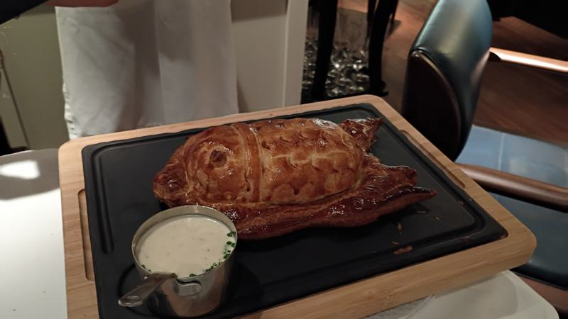

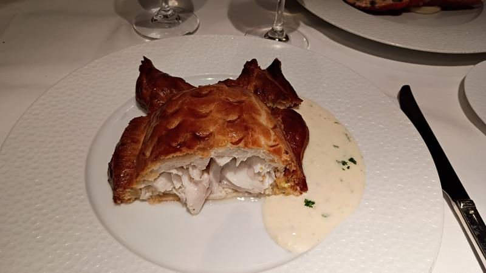

:::

## Mar 14 Sat, Willemstad, Curaçao
Today was our second day in Curaçao, headlined by a morning excursion called, Historical City & Local Street Art Tour.

Our guide shared the island's history as we navigated the city. The primary focus was the vibrant local art scene, starting with a 20 minute walk through the murals in the _Otrobanda_ (the "Other Side") section of town. In recent years, _Otrobanda_ has become the island's art capital. Wandering through its winding alleys we found massive, colorful murals and local art installations. This was followed by a brief stop at a scenic overlook for a panoramic view of the city. We then drove across the bridge to the _Punda_ (the "Point") side of Willemstad and is the oldest part of the city. Once across, we were given 50 minutes to explore independently. We made it back to the ship by 10:30am, exactly at "all aboard" time, and I’m fairly certain our group was the very last to step onto the gangway!

::: {layout-ncol=2}

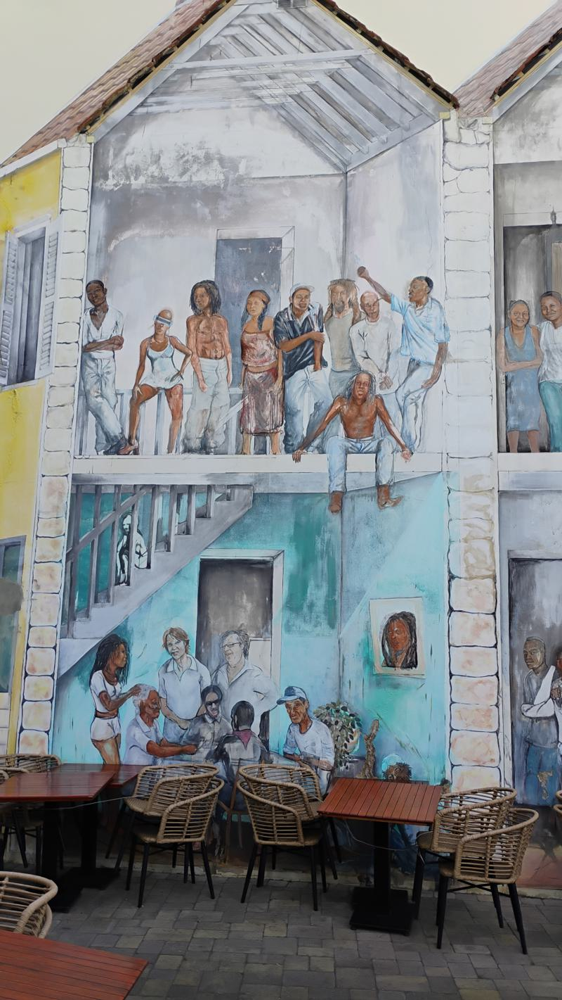

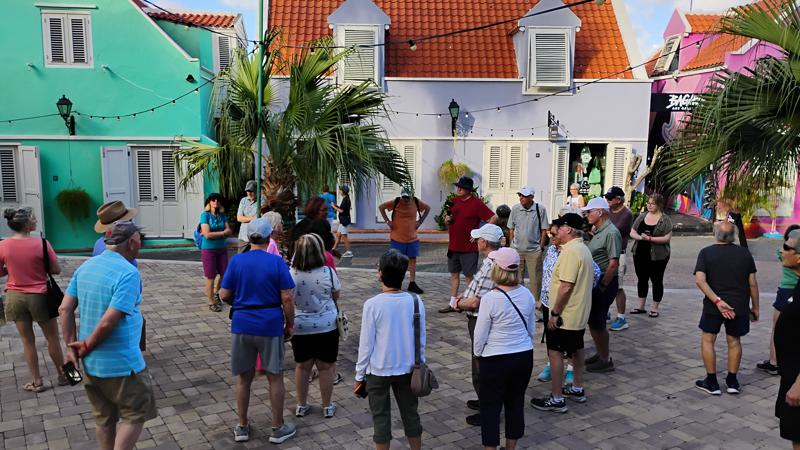

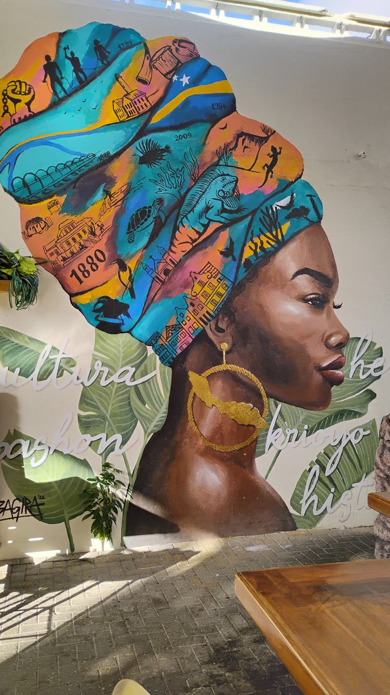

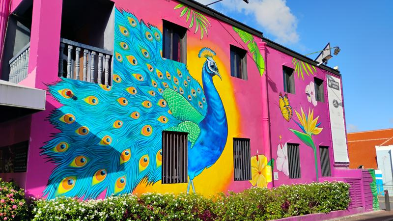

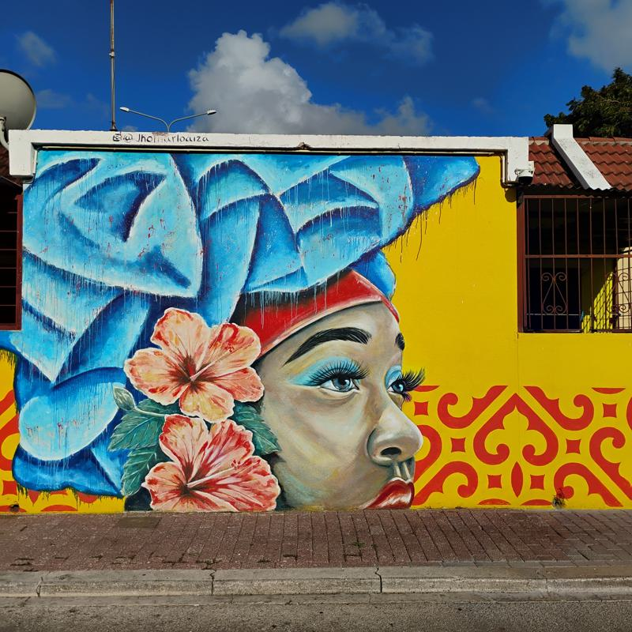

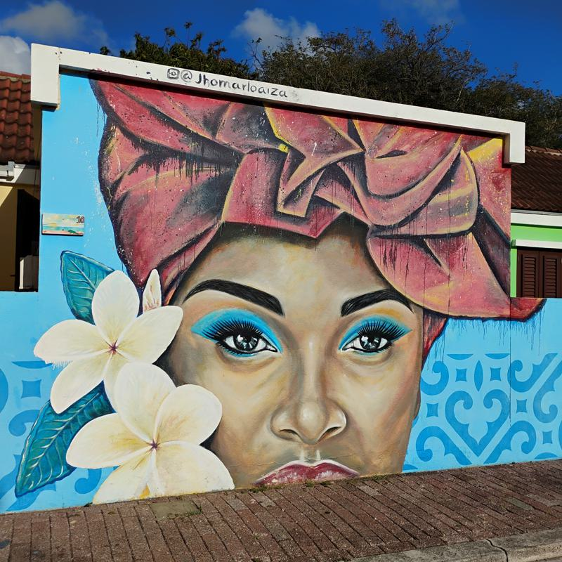

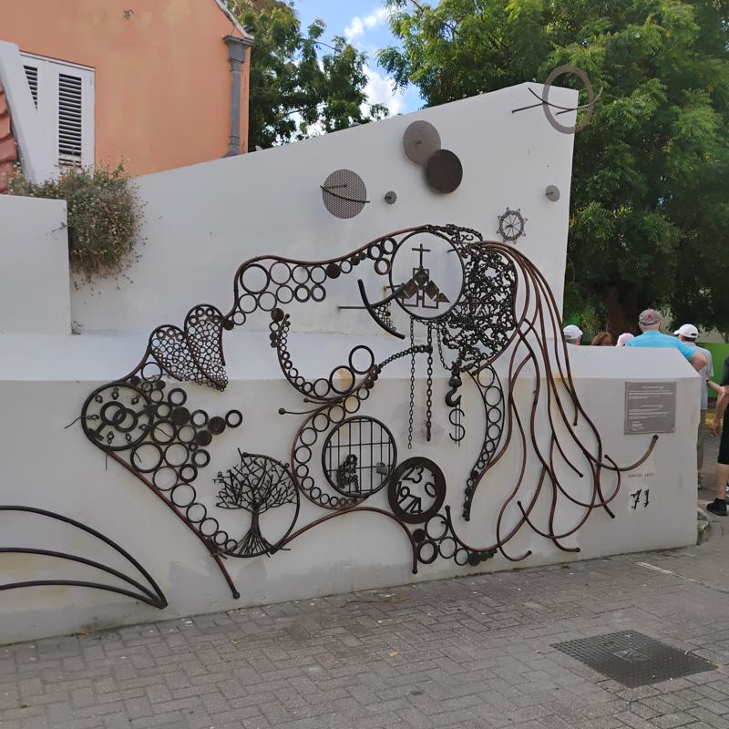

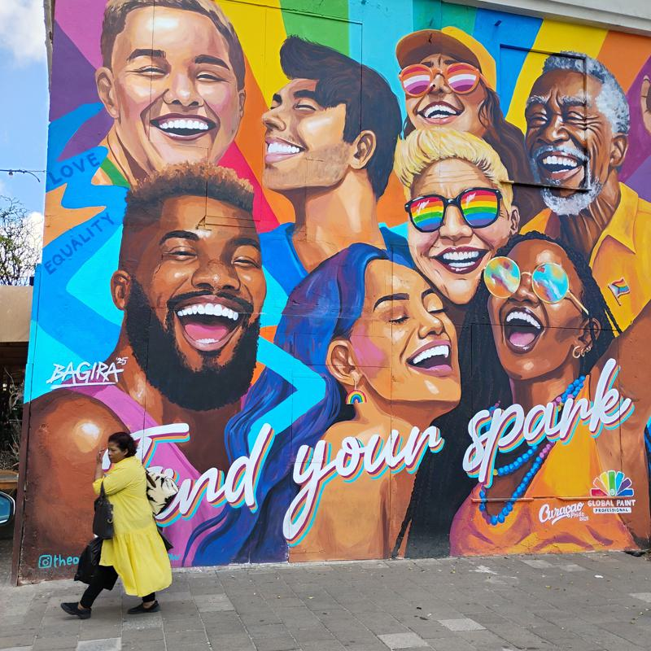

![According to Google the text of this mural is written in _Papiamento_, a creole language spoken in the Dutch Caribbean (Aruba, Bonaire, and Curaçao). The text is somewhat stylized, but here is the translation of the main phrases: _Sudó pa resultá, lina di alimentá, fuerte na holó, diverso na koló_, "Sweat to achieve results, a line to nourish, strong in scent, diverse in color." This likely refers to the hard work of local vendors or fishermen, emphasizing the sensory richness and effort of their daily lives. On the Right Side, _Foi salú ku salí_, "From health that came out" or "Born from health." This is a bit more idiomatic, but it generally refers to something being pure, healthy, or naturally derived from a good state of being.](IMG_20260314_092959612.jpg)

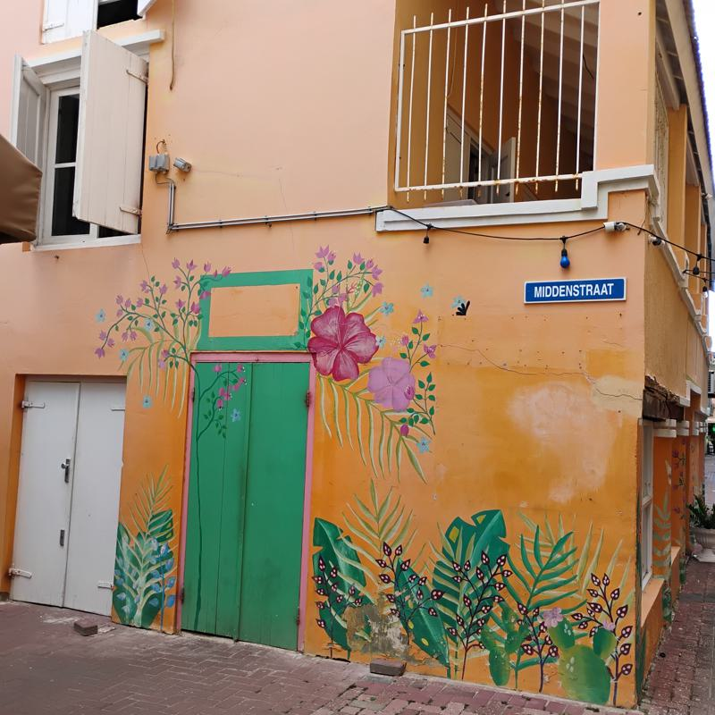

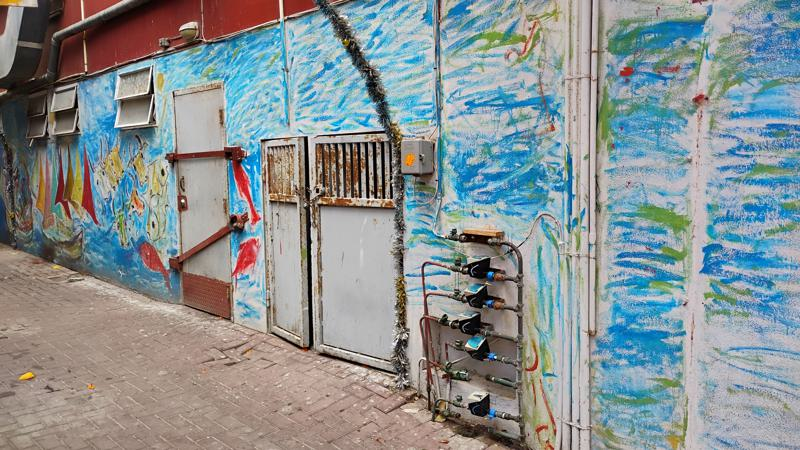

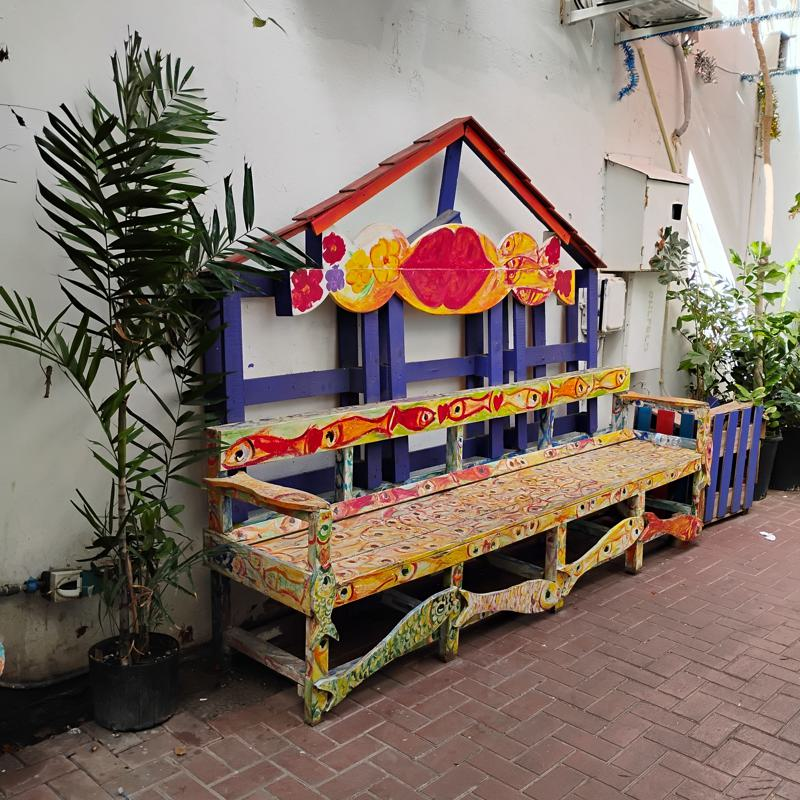

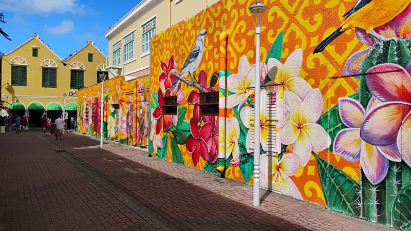

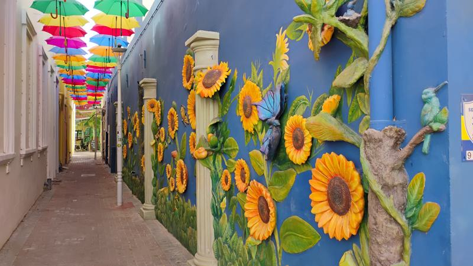

:::

For lunch, we kept things low-key by ordering room service sandwiches to enjoy on our balcony. Afterward, we headed to the spa terrace. It was quite crowded. We spent about 20 minutes in the large thermal spa before Becky headed back to the room. I stayed for a 12-minute session in the steam room before showering.

While Becky finished getting ready, I wandered the ship. The pools were closed due to heavy ocean swells, so I grabbed an iced Americano with cream from the Barista. Later in the afternoon, we met up for tea.

The evening began with drinks at the Horizon Bar followed by a round of trivia. Even though we arrived 10 minutes late, our team still managed to snag second place, proving that Becky and I hardly contributed to the effort. At least it feels that way to us. 

We ended the day with a lovely dinner in the Grand Dining Room with Alan and Shirley. Becky opted for the rack of lamb, while I went with the butter chicken (a curry made from chicken cooked in a spiced tomato and butter-based gravy).

## Mar-15-Sun, St. George's, Grenada
My day began at the Horizons lounge, where I enjoyed my first coffee and a quiet sunrise while catching up on my journal. Once Becky was ready, we headed over to Baristas for a second round. I opted for an Americano with cream, paired with a chocolate croissant and orange coques.

While we were there, Alan stopped by to chat. Since he’s an avid theater-goer, we were curious to hear his take on last night’s show. It turns out he shared our sentiment: it was "okay," but definitely a "one and done" experience. After our chat, we headed to the Grand Dining Room for breakfast, followed by the morning's O-Point activities.

We were scheduled to arrive in Grenada at 1pm, but the weather had other ideas. Due to high winds, the Captain made three unsuccessful attempts to dock, trying both stern-first and bow-first, before ultimately waving the white flag.

Instead of exploring the island, we spent the day drifting about three miles off the coast. The gloomy weather - windy, cloudy and rainy - kept us away from the pool and spa deck, so we spent a cozy afternoon watching the movie Good Fortune. We finally departed Grenadian waters around 9pm.

For dinner, we visited Toscana, where the main courses were the highlight of the evening. Becky had the _Aragosta Fra Diavolo_, which is Maine lobster and tagliolini tossed with garlic, chili peppers, and tomato sauce. I had the _Pollo al Forno_, Parmesan-crusted lemon chicken served with rosemary roasted potatoes and vegetable jardinière.

We capped off the night with evening trivia with our usual group. Unfortunately, we didn't walk away with any O-Points this time, but it was a great way to end the day regardless.

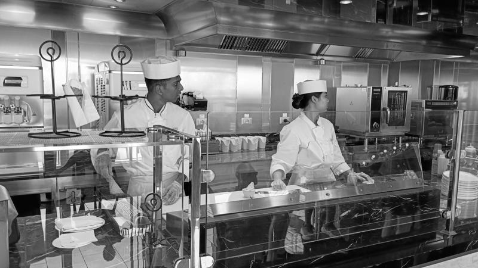

## Mar-16-Mon, Kingstown, St. Vincent
The forecast promised 79°F and sunshine, but the view from our window told a different story: a moody, overcast sky, scattered showers, and a stiff breeze. We opted for room service breakfast - cheese omelets and sausages (skipping the coffee). It arrived promptly at 7:15am.

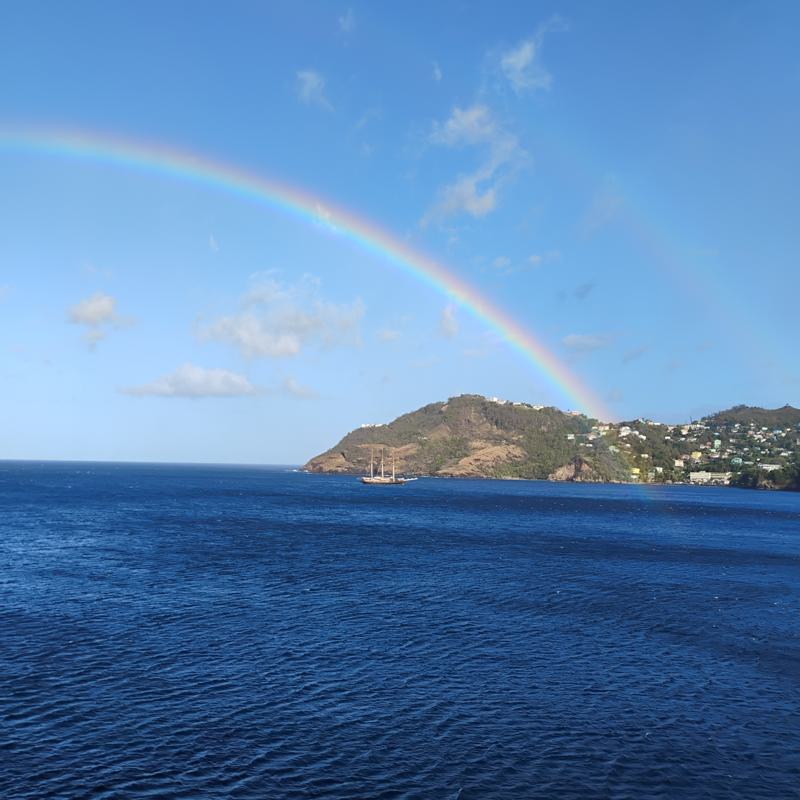

Today’s excursion, The Best of Saint Vincent, came with a few last-minute adjustments. Due to ongoing reconstruction at Fort Charlotte, we swapped the fort for a visit to St. George’s Cathedral. The tour was rated as moderate, involving about an hour of walking on sloped terrain, definitely not a route for wheelchairs.

Our revised itinerary looked like this:

- St. George’s Cathedral: A 15-minute drive followed by a 20-minute visit.
- Botanical Gardens: A 10-minute drive followed by 40 minutes of exploring.
- Scenic Drive: A one-hour journey toward Mesopotamia and a local hotel bar.
- Refreshments: A 25-minute stop before a 25-minute drive back to the pier.

Our first stop was St. George’s Cathedral, located on Grenville Street in Kingstown. This cathedral is the head church of the Anglican Diocese of the Windward Islands. Completed in 1820 using local lava stone, it’s a striking blend of Georgian and Victorian styles. The interior features a circular mahogany pulpit and the famous "Red Angel" stained-glass window. The story is that the window was originally meant for St. Paul’s Cathedral but was rejected by Queen Victoria on account of the angel robed in red.

::: {layout-ncol=2}

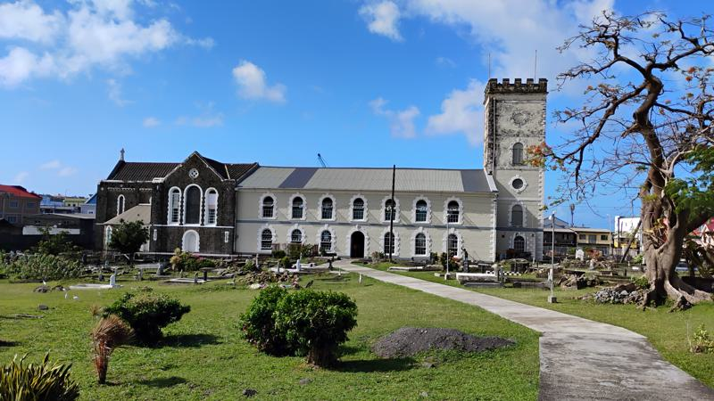

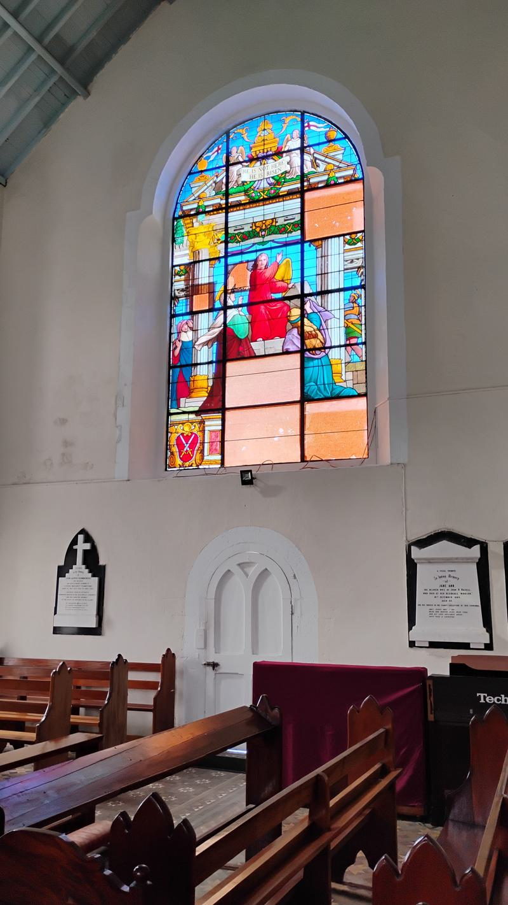

:::

Next was St. Vincent Botanical Gardens. Established in 1765, these are the oldest botanical gardens in the Western Hemisphere. Spanning 20 lush acres, they were originally designed to cultivate medicinal plants. The highlight for many is a descendant of the breadfruit tree brought to the island in 1793 by Captain William Bligh of the HMS Bounty. Becky and I spent most of our time wandering the shaded paths independently. Whenever a plant caught our eye, I used Google Lens to identify the species. The walk was point-to-point, so the bus met us at a different exit. However, the departure was delayed when four passengers went missing, forcing us to head back to the entrance to find them.

::: {layout-ncol=2}

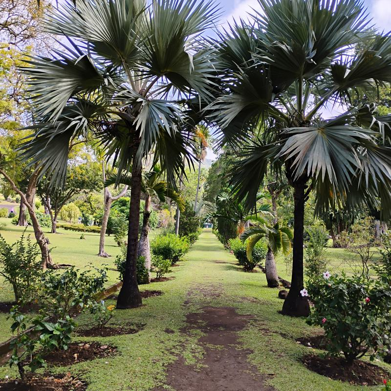

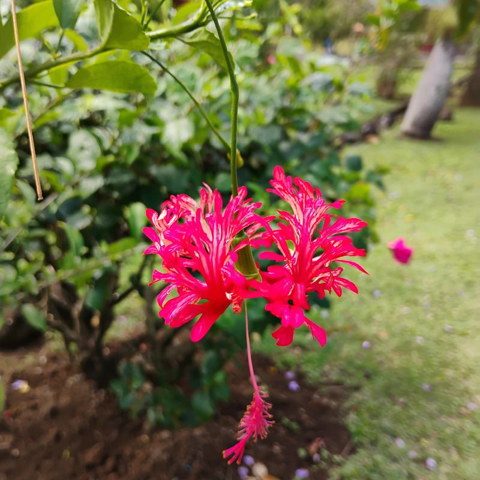

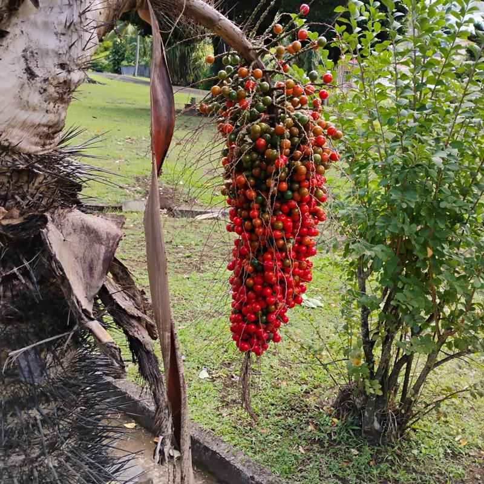

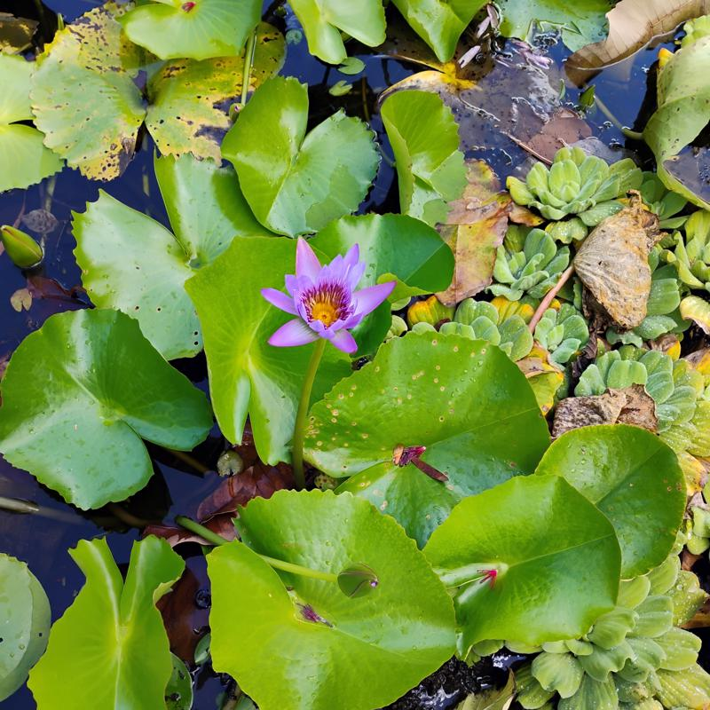

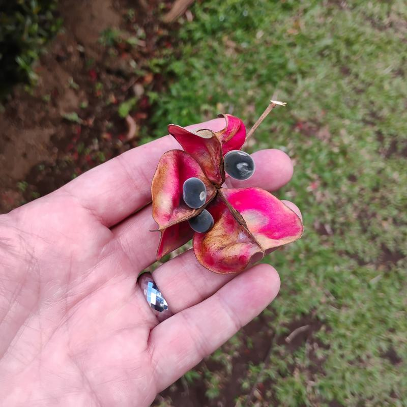

:::

Before heading back, we stopped at a breathtaking viewpoint overlooking both the Caribbean Sea and the Atlantic Ocean. Our final stop was a local hotel for a quick rum punch, though our time there was cut short because we were running behind schedule.

::: {layout-ncol=2}

:::

Once back on the ship, we knocked out some O-point activities before the evening’s main event: a private cocktail party for Oceania Club members in the Horizon Lounge. Despite being "exclusive," the 5:45pm event likely included 90% of the ship. We arrived 15 minutes early to find the room already a quarter full, but we managed to snag a great table with a view of the stage to people-watch as the "Country Club Casual" crowd filtered in.

The night concluded with an invitation to dine in the Grand Dining Room with General Manager Damien Lacroix and Assistant Cruise Director Cathleen Lynette. We were joined by three other couples. One pair lived in Coeur d'Alene, Idaho, while another couple arrived late. The late arriving husband then proceeded to spend the majority of the meal talking about himself. While the invitation was an honor, I don't think we’d opt for an officer’s dinner again. It’s a total roll of the dice; you never know who you’ll be seated next to or how much "small talk" you’ll be forced to endure!

## Mar-17-Tue, Fort de France, Martinique
Today, we docked in Fort de France, the vibrant capital of Martinique. As a French overseas territory, the city carries a distinct European flair that sets it apart from other Caribbean stops. We stuck to our excursion-day routine, enjoying a room service breakfast delivered at 7:20am before heading to the ship's theater for our 8:45am meeting time.

::: {layout-ncol=2}

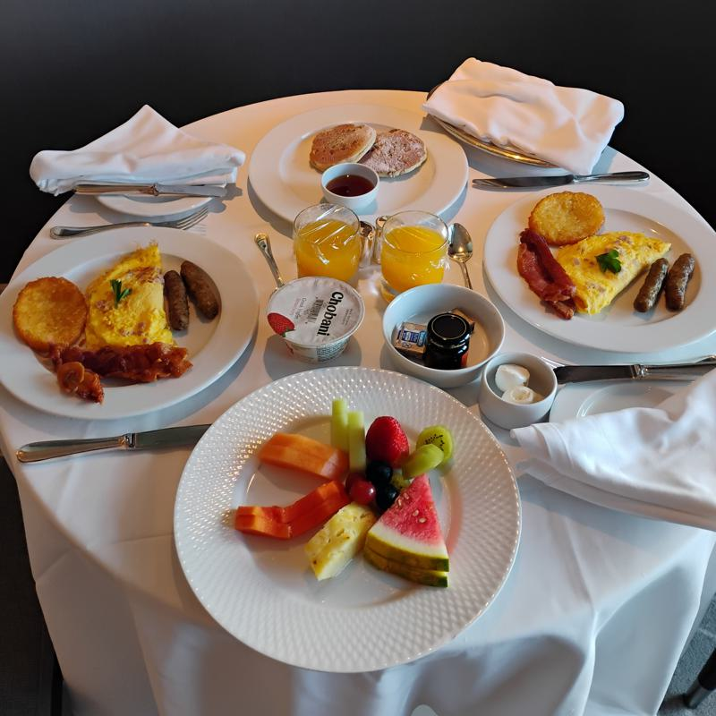

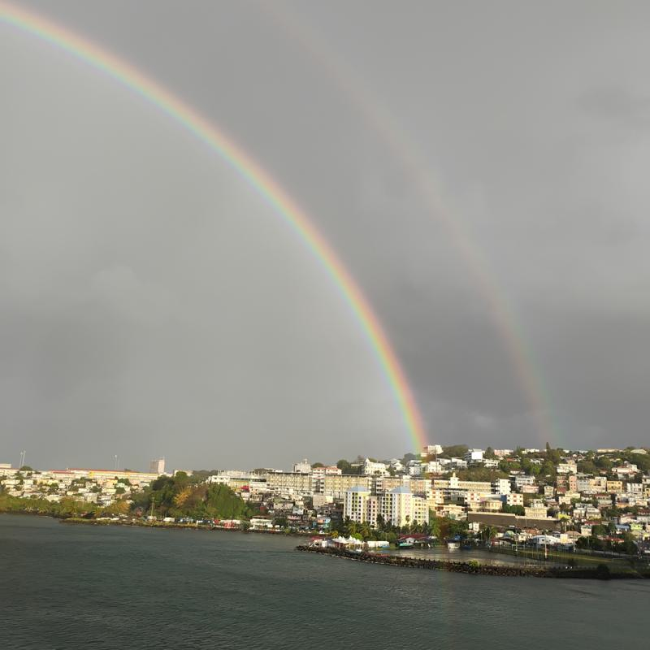

:::

Our group was called right on time. After a short walk to the pier and a brief wait for our fellow travelers to assemble, our party of ten set off for the Clément Distillery. Our tour is called, the Clement Distillery VIP Experience. It started with a drive through the city. The 40-minute drive offered a scenic transition from the European-style architecture of the city to the lush, rolling landscapes of sugarcane and bananas.

The tour itself was a comprehensive look at the Clement Plantation:

- The Grounds: We began with a stroll through beautifully manicured sculpture and botanical gardens.
- The Aging Cellars: Inside the warehouses, we saw rows of casks where the rum develops its character. We even sampled rum straight from the barrel at cask strength. One and three years old, these young spirits were quite harsh!
- The Estate: We explored the historic plantation house and an on-site art gallery.
- The VIP Tasting: We concluded with a formal tasting of four high-end rums paired with small bites. Interestingly, while the rums were top-tier, they all tasted remarkably similar to me!

During the tasting, we sat with a lovely couple from Austin, Texas. The husband is a retired electrical engineer, which seems to be a theme for this trip; I’ve met more engineers on this cruise than on any other!

The Clément Distillery now serves primarily as a historic and tourist site, with most production moved to a modern facility. However, it still upholds the prestigious Appellation _d'Origine Contrôlée_ (AOC) standards. Established in 1996, this is a strictly regulated designation, the only one of its kind for rum in the world, putting it on par with fine French wines. To qualify, the spirit must be distilled from freshly pressed sugarcane juice (_vesou_) rather than molasses. Before leaving, I visited the gift shop to pick up a specific bottle of rum that I had researched online.

::: {layout-ncol=2}

![This photo captures some of the rows of aging barrels, which are stacked on wooden racks. Each barrel head is branded with the distillery's signature insignia, which includes: the portrait of Homère Clément, the doctor and mayor of Le François who purchased the plantation in 1887 and is credited with pioneering the "Agricole" style of rum. The inscriptions read _Habitation Clément_ and _Domaine de l'Acajou_, the original name of the estate. The bottom of the stamp clearly denotes the orgin, _François Martinique_.](IMG_20260317_104000885.jpg)

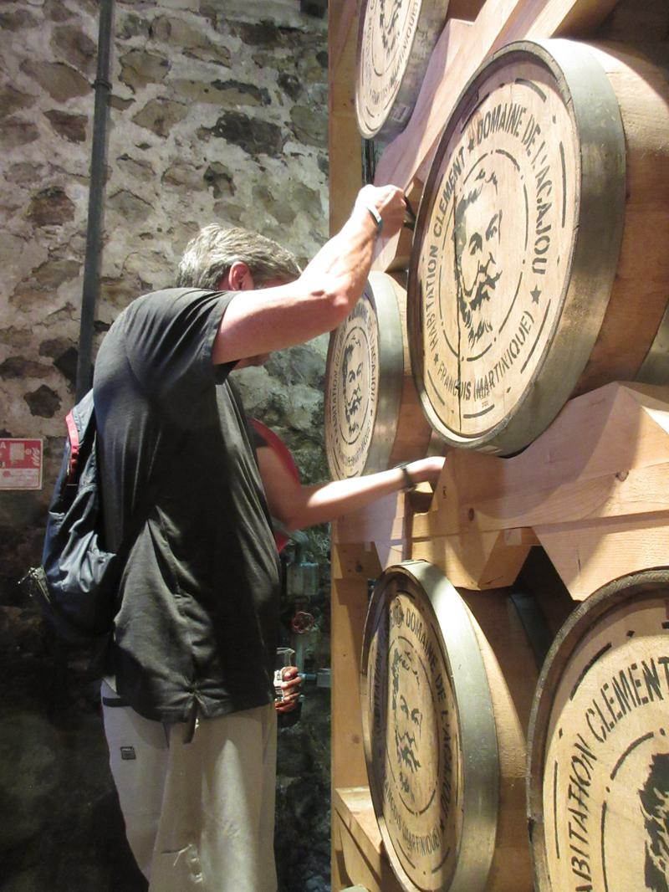

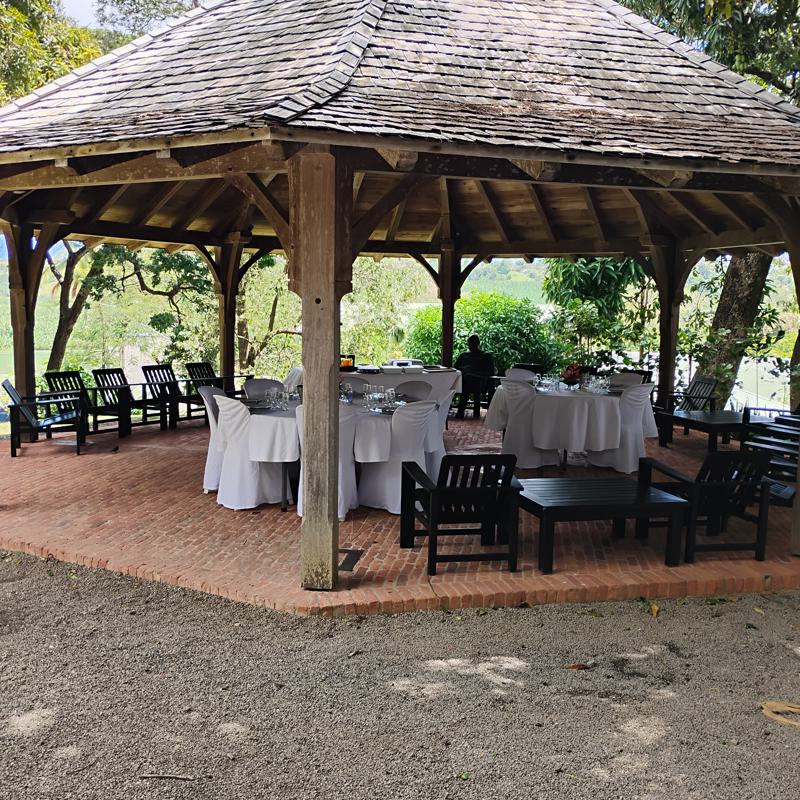

![These are the rums we sampled as part of the tour. These rums represent the "Prestige" and "Cellar Master" tiers of their collection. _Clément L'Élixir_, the most striking bottle in the photo, characterized by its elegant, teardrop-shaped decanter and is a blend of very old rums selected for their unique aromatic concentration. It typically features deep notes of gingerbread, cinnamon, and stewed fruits. It is considered a top-shelf sipping rum, often reserved for special occasions. The rectangular, wide-shouldered bottle on the right is the _Cuvée Homère_, named after the distillery's founder. This is the flagship of the "Cellar Master's" selections. It is a complex blend of the highest-rated vintages aged in French and American oak. It is known for its long finish with notes of toasted almond and pepper. The rounded bottle on the left is  _Cuvée de l'Habitation_. The tall, dark bottle in the back, partially obscured by its black box, is a Single Batch or a specific 15 year release. All of these rums tasted very similar to me and I didn't really enjoy them that much. They all were a bit harsh and strong.](IMG_20260317_114448058_HDR.jpg)

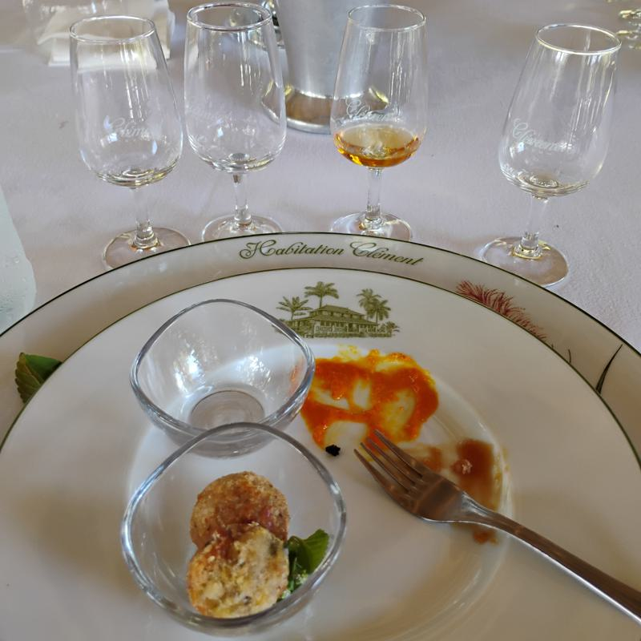

![I purchased this bottle of rum. Before leaving home I researched the various types of rums available from the distillery and this one seemed the most interesting and not too expensive.  This is a bottle of _Clément V.S.O.P. Rhum Vieux Agricole_, one of the most popular from the Clément distillery. The V.S.O.P. (Very Superior Old Pale) label under Martinique’s strict AOC (_Appellation d'Origine Contrôlée_) regulations, describes the youngest rum in the blend must have been aged for at least 4 years in oak barrels. Unlike most rums made from molasses, this is distilled directly from freshly pressed sugarcane juice. The label notes _Vieilli en Fûts de Chêne_ (Aged in Oak Barrels). Clément typically uses a combination of virgin French oak and re-charred Bourbon barrels to achieve its signature profile. After returning home, I opened the bottle for a sample and it was surprisingly good, but it didn't really taste like the rum I normally buy to make tropical drinks. It tasted more like a light whiskey. I should have bought two bottles.](IMG_20260317_130716132.jpg)

:::

The drive back took another 40 minutes. Once back at the port, Becky and I took a walk to the Saint Louis Cathedral to admire its unique architecture and take a few photos.

::: {layout-ncol=2}

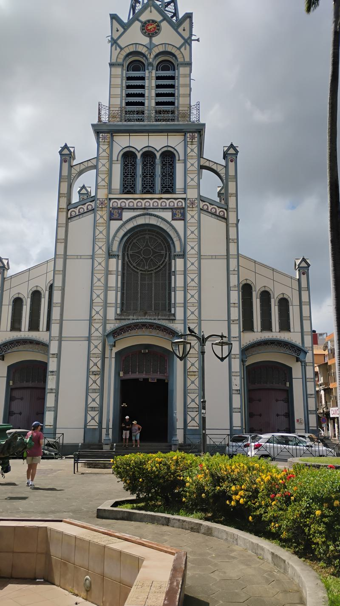

![The interior of the Cathedral. The current structure, completed in 1895, is the seventh church built on this site. Its predecessors were repeatedly destroyed by natural disasters, including fires, cyclones, and earthquakes. It was designed by Pierre-Henri Picq, who utilized a metal framework (inspired by the work of Gustave Eiffel) to ensure the building could withstand the island's volatile climate. Because the frame is made entirely of iron beams, the cathedral is fireproof and flexible enough to endure seismic activity. This industrial aesthetic led to its famous nickname, with some locals even jokingly comparing it to a "Catholic railway station."](IMG_20260317_141012512_HDR.jpg)

:::

We wrapped up the afternoon with a round of trivia. Unfortunately, our team’s winning streak didn't hold, and we walked away with zero O-points.

::: {layout-ncol=2}

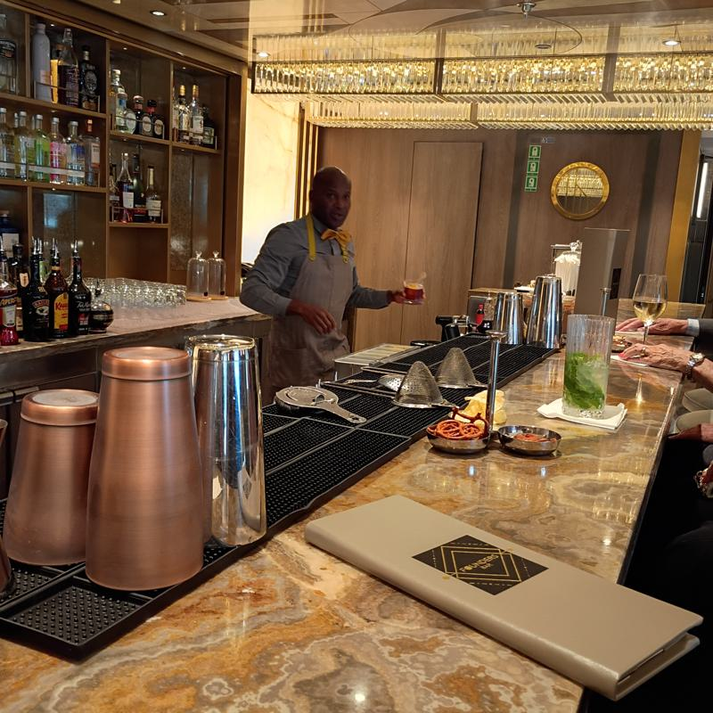

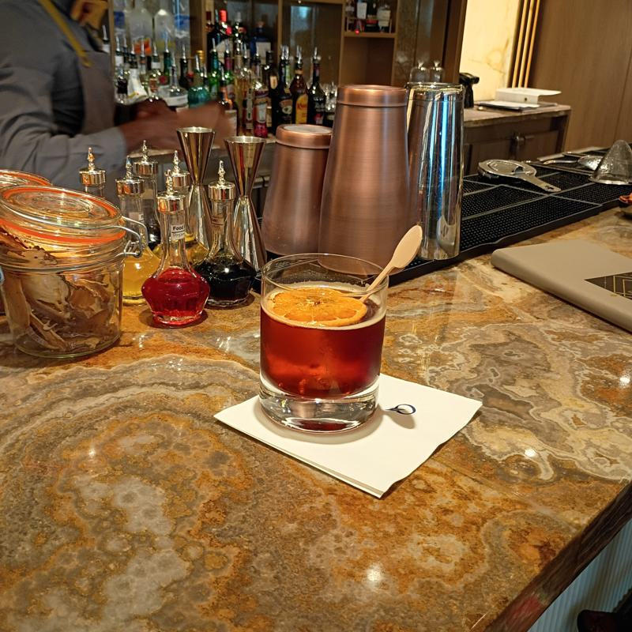

:::

For dinner, we headed to the Terrace Cafe buffet and enjoyed a great meal with two of our trivia partners from Toronto.

## Mar-18-Wed, Tortola, British Virgin Islands
Today we arrived in Tortola, the largest and most vibrant hub of the British Virgin Islands. Though the ship wasn't scheduled to dock until 11:30am, I was up early to start the morning.

By 6:14am, I was in the Horizon Lounge with a cappuccino from the machine. The sun was already up, casting a soft light over the water. Since another passenger had claimed my usual spot, I shifted to the other side of the lounge to enjoy the quiet. 

Later, Becky and I headed to the Grand Dining Room for breakfast; I opted for a Western omelet, while Becky enjoyed a custom omelet paired with lamb chops.

Our excursion for the day was a five-hour trip titled "Escape to Jost Van Dyke." After meeting in the ship’s theater at 11:45am, we set off for this tiny, three square mile gem. While Tortola is known for the bustling marinas of Road Town and the heights of Sage Mountain, Jost Van Dyke offers a quintessential, laid-back Caribbean escape.

Our destination was the famous White Bay, a stunning crescent of powdery sand and turquoise water. Because there is no dock, the bay is famous for boaters who anchor offshore and swim to the beach, a tradition that gave the legendary Soggy Dollar Bar its name, as patrons often arrive with soaking wet currency.

Our catamaran pulled right up to the shore, allowing us to climb down a bow ladder into about two feet of water and wade onto the sand.

The beach was quite lively and crowded, likely due to the spring break season. We walked past the Soggy Dollar, catching a glimpse of people playing ring toss and sipping the original "Painkiller" - the famous blend of dark rum, coconut, pineapple, and orange juice topped with fresh nutmeg.

To escape the crowds, we walked to the far end of the beach. We found a plastic chair to store our belongings and spent the afternoon swimming in the turquoise water and relaxing in the shade.

On the return trip, the crew served rum punches. They were a bit weak on the rum, which was probably for the best as the sea had turned a bit rocky and the boat was rolling.

::: {layout-ncol=2}

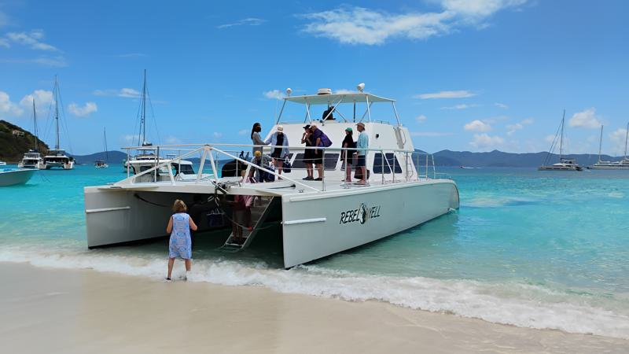

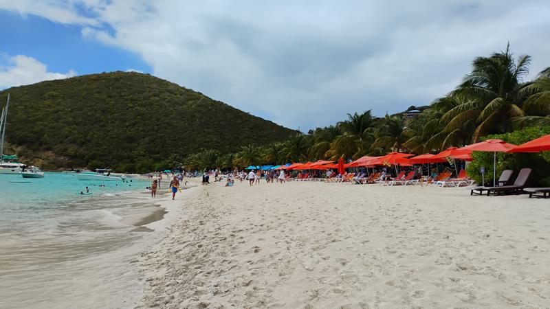

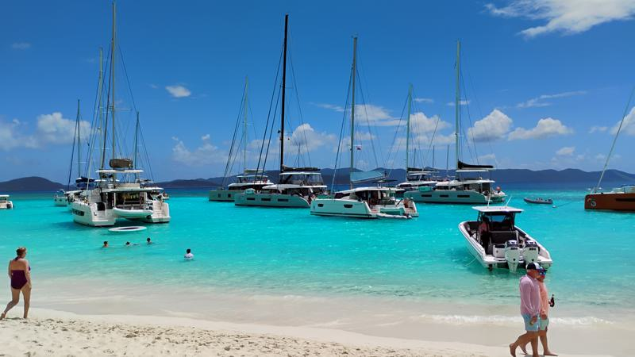

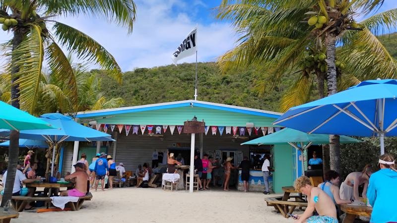

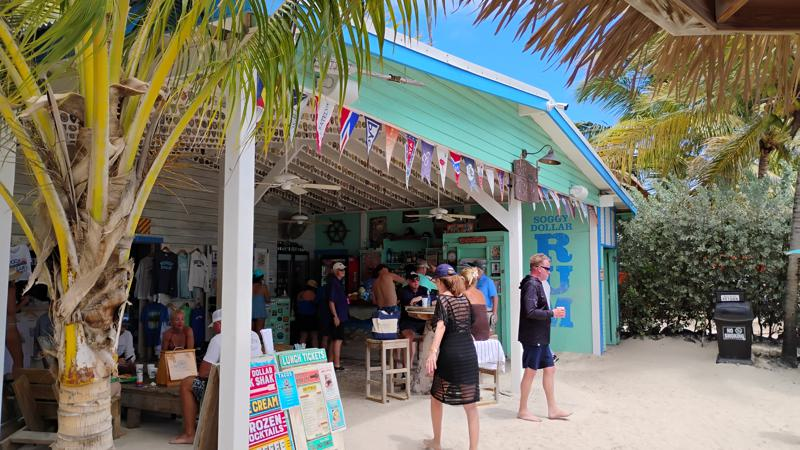

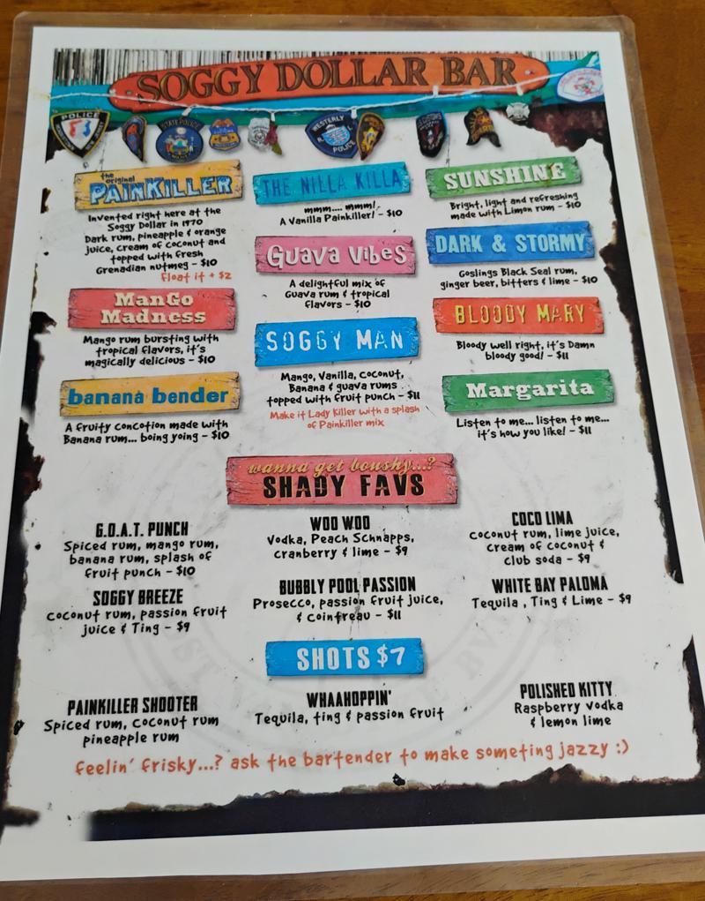

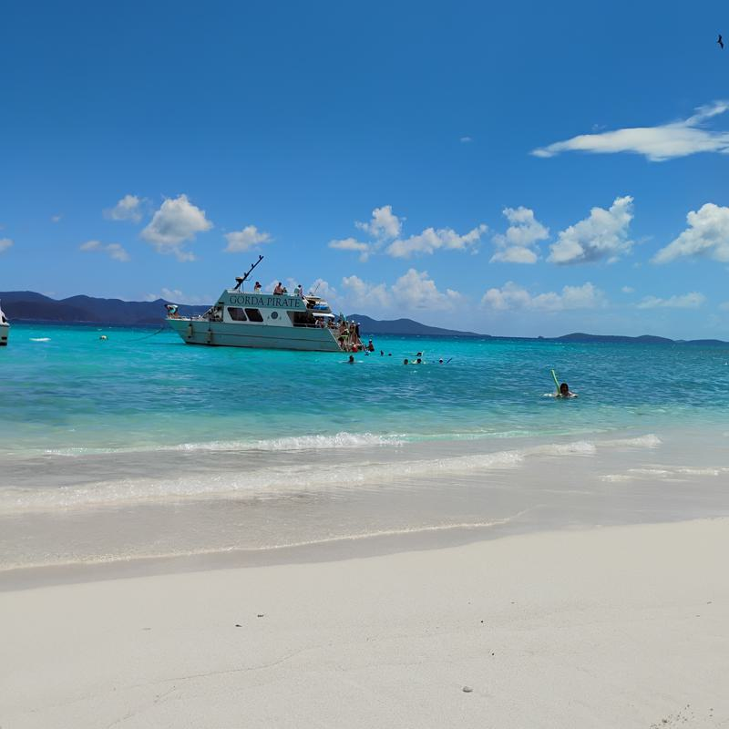

:::

We decided to end our day with a quiet evening. Dinner tonight was served in our suite, featuring dishes ordered from Jacques, the French restaurant. Becky enjoyed the shrimp in tomato-cognac cream sauce, while I had the filet mignon, seared foie gras and truffle sauce. 

::: {layout-ncol=2}

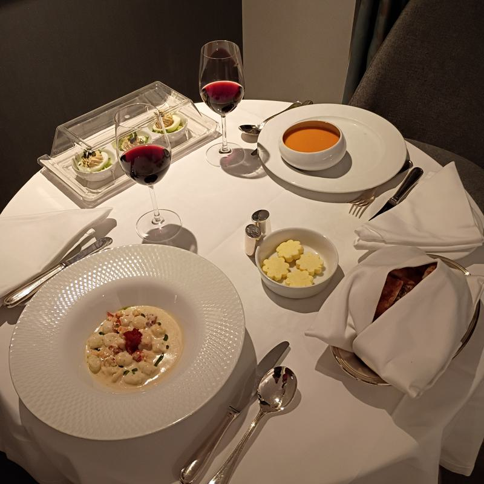

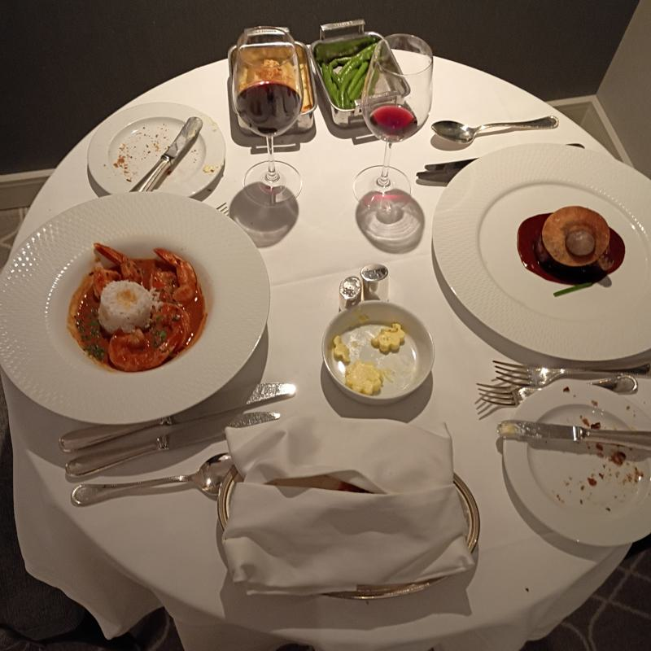

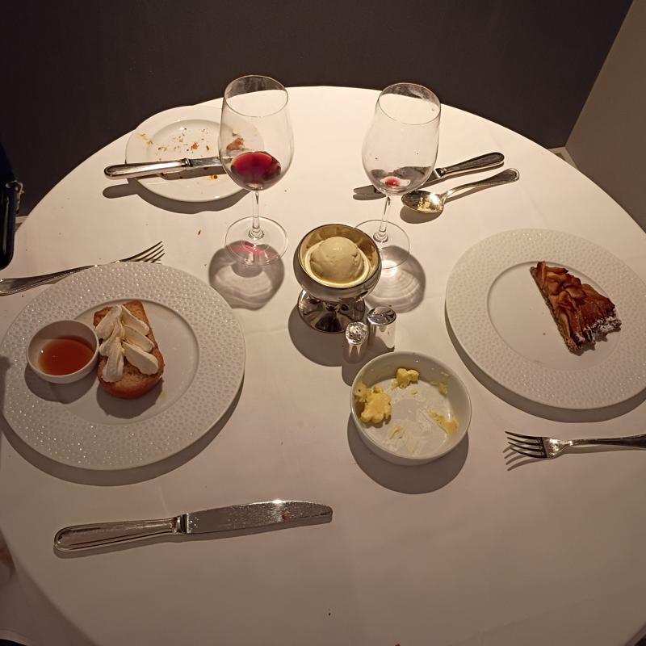

:::

## Mar-19-Thu, At Sea
My morning began with a slight detour; the coffee machine in Horizons was blinking red and in need of service, so I popped down to the Executive Lounge to grab my morning fix of caffeine. With coffee in hand, I headed back up to Horizons just in time to catch a beautiful sunrise. Later on, we kept the caffeine flowing with another round at Baristas.

For breakfast, we visited the Grand Dining Room, where I enjoyed the Eggs Benedict while Becky opted for an omelet.

The day was largely defined by the O-point challenges. We stayed active throughout the afternoon, participating in various events and testing our luck at Team Trivia, where we managed to snag third place.

Lunch was a casual affair at The Bakery, where we each had a small ham and onion quiche and a few finger sandwiches. We couldn’t resist a sweet finish, so we stopped by the Crêperie for some ice cream and a plain crêpe.

Between activities, we started watching a film called Roofman. We didn’t quite realize it was a two-hour commitment, so we called it at the halfway mark and planned to finish the rest tomorrow.

Dinner took us to Red Ginger, the ship’s Asian-themed specialty restaurant. Becky chose the lamb chops, and I went with the beef teriyaki.

We also took care of some "ship business”. We visited the gift shop to use up the last of our non-refundable onboard credit. I then stopped by reception to cash out our refundable portion, leaving us with a final credit balance of just $1.90.

By the evening, our luck improved significantly, we took first place in evening trivia, adding three more points to our total!

To cap off the night, we attended "Our World," a vibrant theatrical celebration of global music and culture. It was a wonderful performance, made even more special by a heartfelt salute from the Allura crew at the end of the show.

## Mar-20-Fri, At Sea
We started our morning peacefully in the Horizon Lounge, where I spent some time journaling over coffee. Afterward, we headed to Batista’s for a second round of coffee and some fresh pastries.

The weather was a bit of a mixed bag today; it began cloudy and rainy, with the low moan of the fog horn echoing occasionally. Thankfully, the sun finally made an appearance in the afternoon.

Our morning was packed with entertainment, starting at 9:15am with Giant Jenga. We didn't join in, but it was fun to watch the entertainment team lead the chaos for a bit. Later we played indoor carpet darts and Bocce Ball to earn additional O-points.

At 1:30pm, we attended the “Pinot Noir, the Heartbreak Grape” wine tasting. We only stayed for the first half hour, as we had to rush off to the Art Scavenger Hunt reveal at 2pm. Our efforts paid off, we each walked away with 20 O-points for completing the challenge!

The winning streak continued at 2:30 PM during Team Trivia, where we secured three O-points each for taking first place. 

Shortly after, it was finally time for the O-point redemption at 3:45pm. We traded in our hard-earned points for the following items: a men's cotton t-shirt, a golf towel, a backpack, socks and a tote bag. 

The rest of the afternoon was spent back in the cabin. We started packing while watching the end of a movie to make the chore a bit more enjoyable.

To top off the day, we headed to the Grand Dining Room for dinner. We both enjoyed the beef bourguignon while sharing the table, and good conversation, with our trivia partners, Frank and Franie, who split their time between New Jersey and Vermont.

::: {layout-ncol=2}

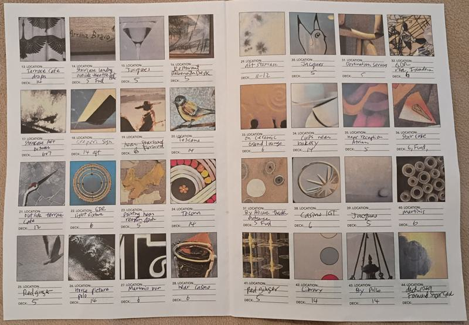

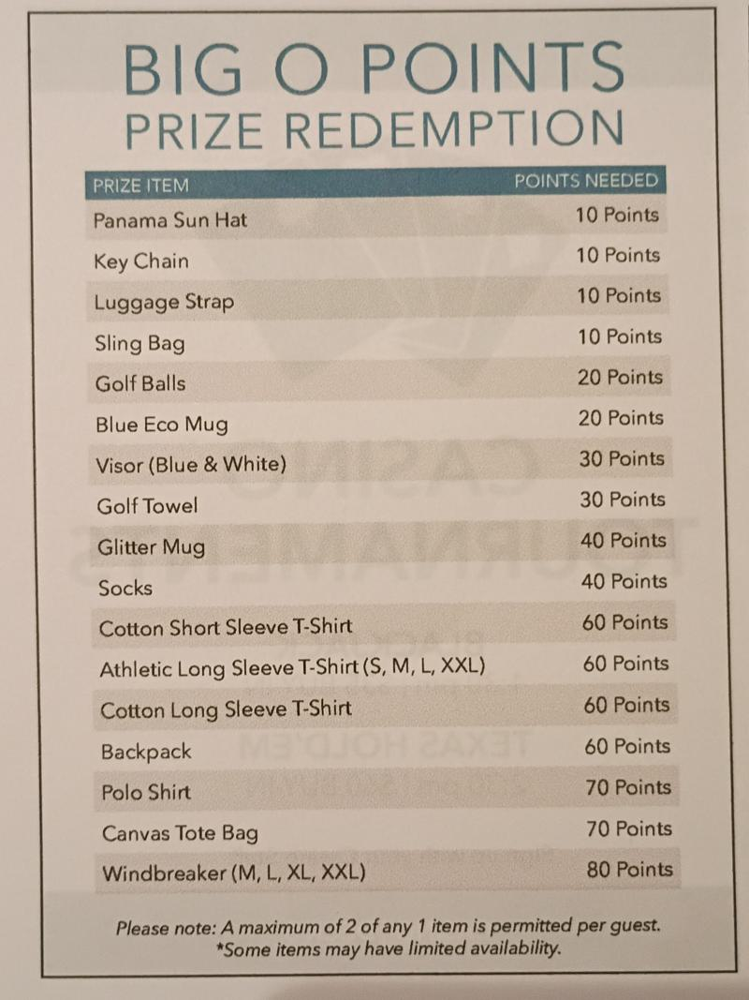

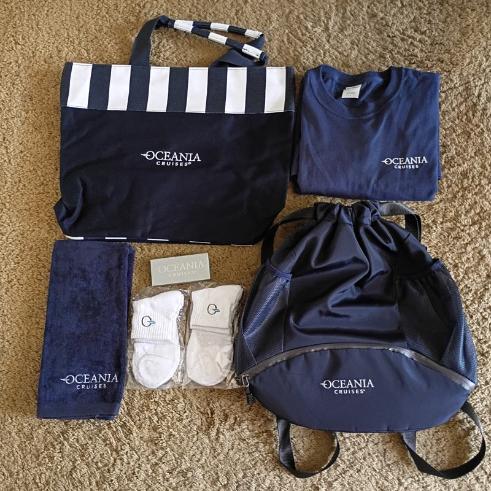

:::

## Mar-21-Sat, Disembark, Miami, Florida
We woke up early to prepare for our final morning on the Allura, which had already docked in Miami by 5:30am. Based on past experience, we knew we had to vacate our cabin by 8am, so we headed to the Grand Dining Room at 6:45am to wait for the doors to open. Despite our hopes for an early start, breakfast service began right on time at 7am. Becky opted for a "build-your-own" omelet and an English muffin, while I went with a Western omelet.

On our way to breakfast, we noticed other passengers already gathered in the lobby, likely hoping to disembark as soon as possible for early flights. We finished our meal by 7:40am and headed back to the cabin for final packing, brushing our teeth and a final sweep of the room checking that we had everything.

We left our room around 8:15am and made our way to Deck 5. Because we had a late flight, we were among the last groups to be called. Our number finally came up at 9:15am, and by 9:30am, we were in a car bound for the airport.

American Airline check-in was relatively smooth, though the process was entirely digital. After printing our own bag tags and dropping off our luggage, I went back to the kiosk to print physical boarding passes. I always prefer having a paper copy; it’s much easier than fiddling with a phone at TSA or the gate. Security was a breeze, TSA Pre-Check took only five minutes, involving a quick driver’s license scan and a photo for facial recognition.

Our flight wasn't for another six hours, and we headed to the Turkish Airlines Lounge in Concourse E. Unfortunately, we were turned away and told to return at 3:30pm due to their three-hour stay limit.

To pass the time, we found a quiet gate to rest, and eventually, boredom set in. We decided to get some steps in by walking the full length of Concourse D, about a mile in total, and took a loop on the SkyTrain to see the rest of the airport. At 2:34pm, we received a notification that our flight was delayed by half an hour. I was glad to have my paper boarding pass, ensuring the new timing wouldn't cause any issues with our lounge access.

We checked into the lounge at 2:55pm. We were directed toward the quieter overflow room to the right of the reception. It was a much more relaxing environment compared to the busy dining area.

The lounge offered a respectable spread of Mediterranean-inspired mezze, salads and sandwiches, alongside a self-service bar. I enjoyed a few small sandwiches and a beer, followed later by coffee and cookies. As we left around 5:45pm, we saw a line of thirty people waiting to get in, we definitely timed our visit well.

::: {layout-ncol=2}

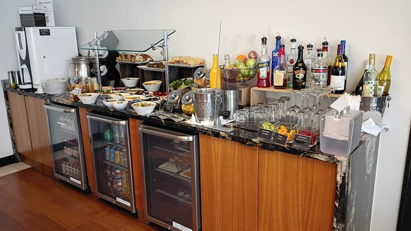

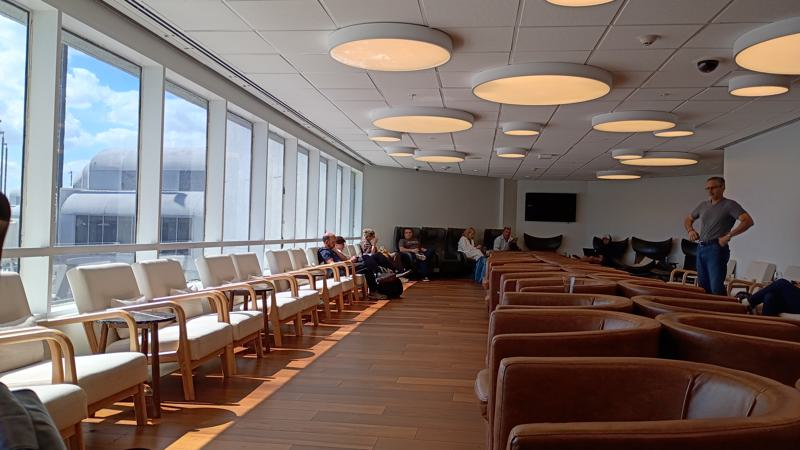

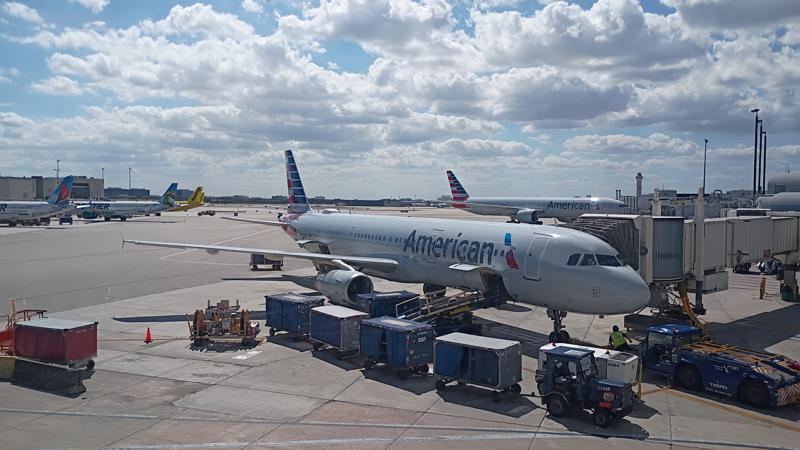

:::

We boarded at 6:20pm, and by 7pm, the doors were closed and we were pushing back from the gate. The service was excellent; they even provided hot towels before the meal. I had the chicken and Becky had the beef, both were quite good for airline food. I spent the five-hour flight listening to my audio book and catching a bit of sleep before we landed at 9:15pm local time.

After collecting our bags, we only had to wait five minutes for the FlyAway bus to Van Nuys. We boarded the nearly empty bus at 10:10pm. Despite some construction and a crash on the freeway, we arrived at the Van Nuys bus terminal about 40 minutes later. We loaded the bags into my old Honda and made the final drive home, finally pulling into the driveway at 12:20am.

